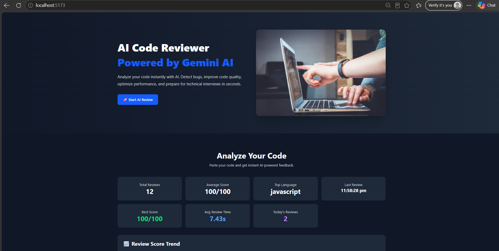
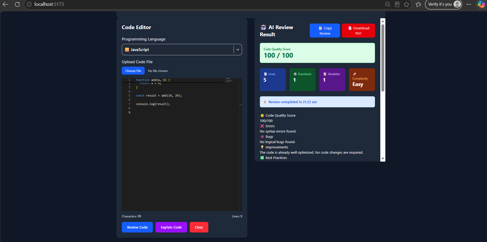
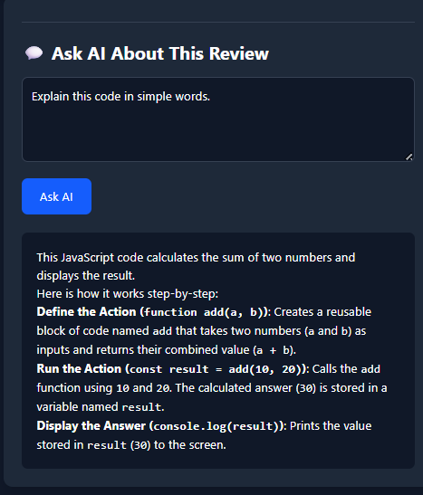
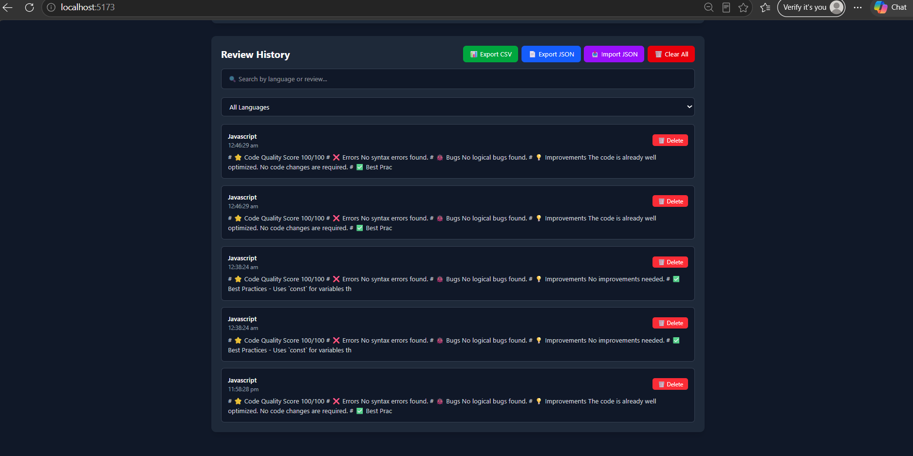
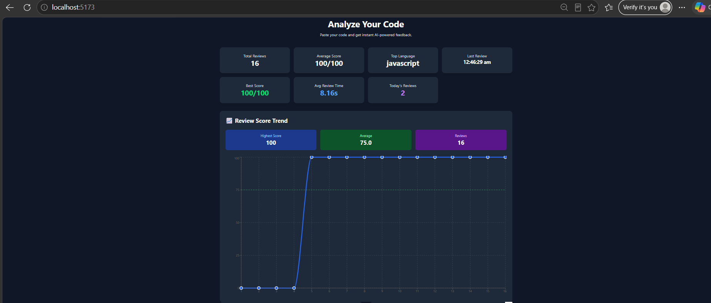

# 🤖 AI Code Reviewer

An AI-powered Code Review platform built with **React.js**, **Node.js**, **Express.js**, and **Google Gemini AI**.

Analyze code, explain code, ask AI questions, download reports, and manage review history.

---

# 🚀 Live Demo

### Frontend

https://ai-code-reviewer-coral-kappa.vercel.app/

### Backend

https://ai-code-reviewer-z00c.onrender.com/

---

# ✨ Features

- 🤖 AI Code Review
- 📖 Explain Code
- 💬 Ask AI About Review
- 📊 Review Dashboard
- 📈 Review Analytics
- 📂 Review History
- 📄 Download PDF
- 📊 Export CSV
- 📄 Export JSON
- 📥 Import JSON
- 🌙 Dark Mode
- 📱 Responsive Design

---

# 🛠 Tech Stack

### Frontend

- React.js
- Vite
- Tailwind CSS
- Axios
- React Markdown
- React Hot Toast
- Recharts
- html2pdf.js

### Backend

- Node.js
- Express.js
- Google Gemini AI
- dotenv
- cors

---

# 📸 Screenshots

### 🏠 Home



### 🤖 AI Review



### 💬 Ask AI



### 📂 Review History



### 📊 Dashboard



---

# ⚙ Installation

```bash
git clone https://github.com/Pithiyachirag/AI-Code-Reviewer.git
```

## Frontend

```bash
npm install
npm run dev
```

## Backend

```bash
cd server

npm install

npm start
```

---

# 👨‍💻 Author

**Chirag Pithiya**

GitHub:
https://github.com/Pithiyachirag